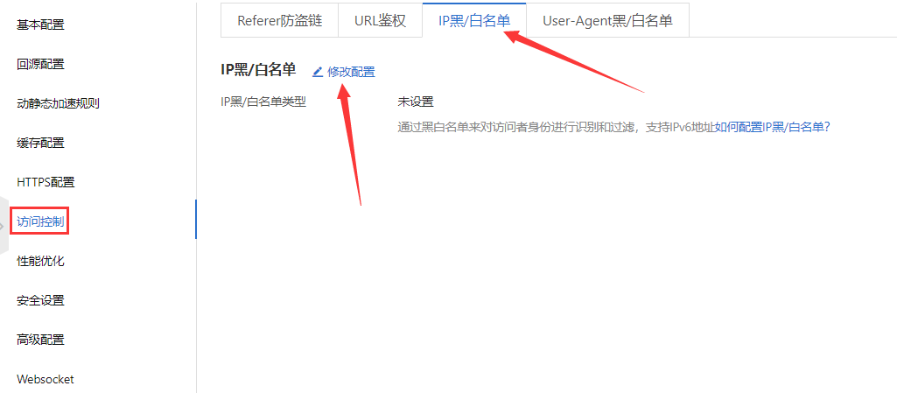
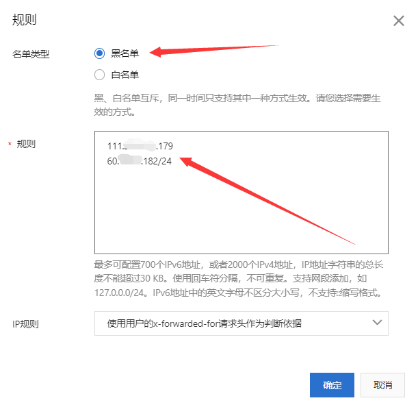
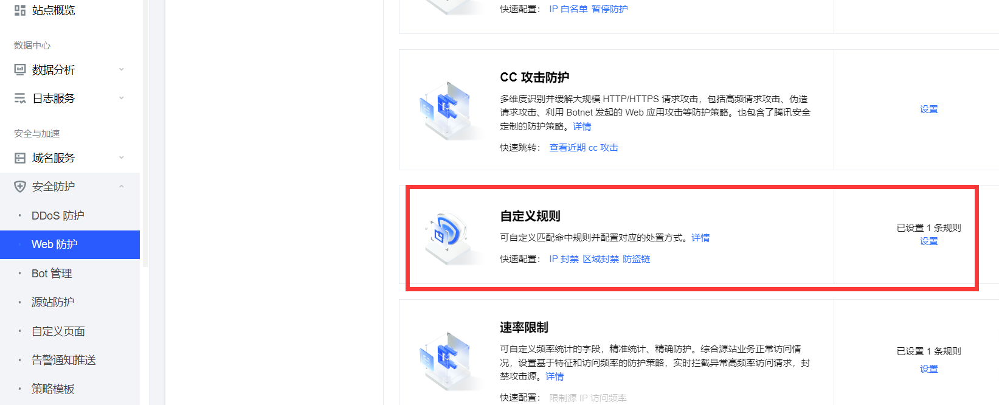
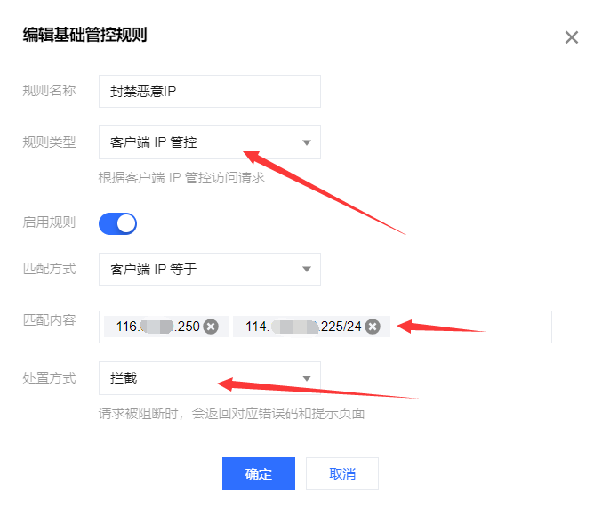
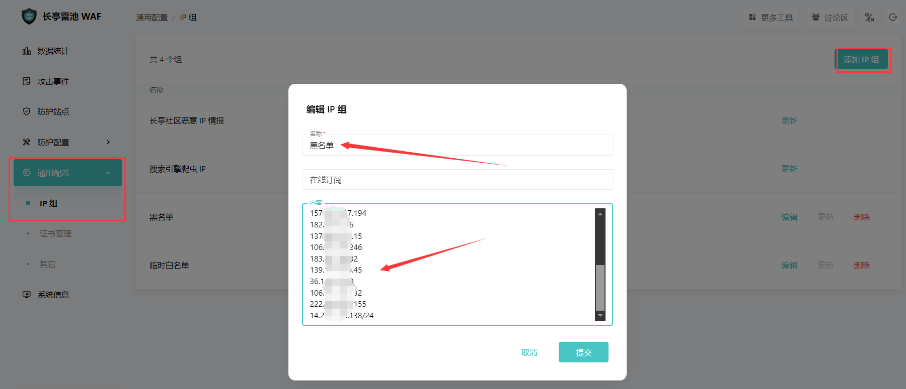
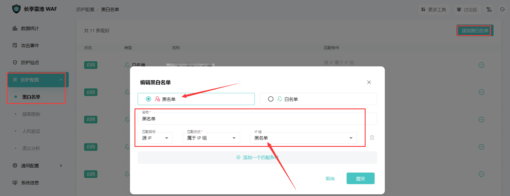
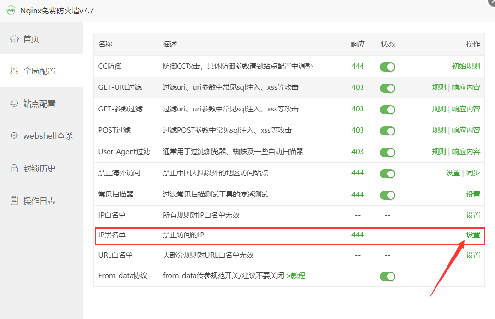
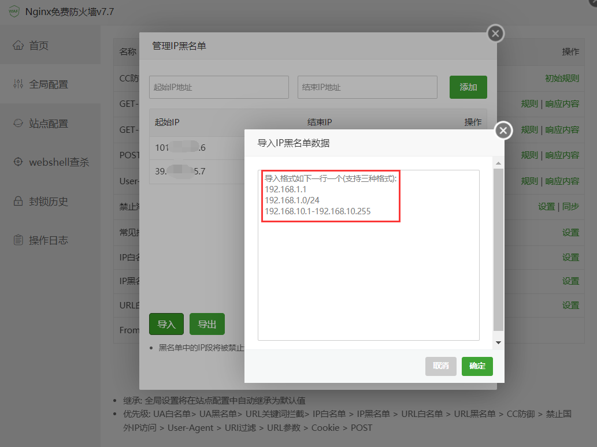

## 📝1# 国内恶意IP收集封禁计划

最近团队系列站群遭受到了大量流量攻击，攻击源均来自于国内傀儡机，我就想建立一个国内恶意威胁情报库，能够快速识别、整理以及封禁这些恶意IP，防止对业务产生影响。

由此，「国内恶意IP收集封禁计划」诞生了：

- 本项目为「国内恶意IP收集封禁计划」，只要搭建于互联网的公开资产，总会遭到各式各样的恶意攻击，本项目致力于一网打尽国内恶意的IP，还赛博空间一片清净。
- 本项目为一个社区项目和开源公益项目，需要大家的支持，如果各位站长遭受到国内恶意IP的攻击，可以将攻击的国内IP、域名或者IP段整理好发布到此项目。
- 这样不断积累使得仓库形成规模后，可以批量封禁国内恶意IP和相关域名，尽量使自己的IP免受攻击影响。


## 🚨2# 项目说明

项目主体结构如下，非常简单：

```php
├─ README.md         # 本项目的整体说明文档
│
├─ DDoS_CC_Attack
│      IPv4_恶意地址.txt    # 存放国内进行DDoS攻击和CC攻击的恶意IPv4地址
│      IPv4_恶意地址段.txt  # 存放国内进行DDoS攻击和CC攻击的恶意IPv4地址段
│      IPv6_恶意地址.txt    # 存放国内进行DDoS攻击和CC攻击的恶意IPv6地址
│
├─ Intrusion_Attacks
│      IPv4_恶意地址.txt    # 存放国内未经授权进行渗透测试、扫描的恶意IPv4地址
│      IPv4_恶意地址段.txt  # 存放国内未经授权进行渗透测试、扫描的恶意IPv4地址段
│      IPv6_恶意地址.txt    # 存放国内未经授权进行渗透测试、扫描的恶意IPv6地址
│
└─ Phishing_Attack
        Domain_恶意域名.txt  # 储存国内钓鱼攻击的恶意域名
        IPv4_恶意地址.txt    # 储存国内钓鱼攻击的恶意IPv4地址
```

目前数据的主要来源：

- [「渊龙Sec安全团队」](https://www.aabyss.cn/)相关站群所受到和捕获的攻击
- 朋友提交给我的，他们的网站所遭到攻击的威胁情报
- 期待屏幕前的各位师傅参与本计划，欢迎给我们提交PR提供新的威胁情报🥳

由衷感谢每一位支持「国内恶意IP收集封禁计划」的师傅们！🥰


## ✈️3# 如何封禁IP或IP段

本文提供几种常见产品封禁IP的方法，具体产品请看产品说明文档或者咨询对应产品客服

**注：经过实际情况测试，遇到DDoS或者CC攻击时，在CDN上封禁对应IP或IP段（ACL禁止），并重启源站服务，网站会非常快恢复，并且消耗的流量会非常小**

### 3.1 阿里云CDN

找到 `访问控制` -> `IP黑/白名单` 填写要封禁的IP或者IP段，如下图：

<table>
  <tr>
    <td></td>
    <td></td>
  </tr>
</table>

### 3.2 腾讯云CDN

找到 `Web防护` -> `自定义规则` -> `客户端管控` 填写要封禁的IP或者IP段，如下图：

<table>
  <tr>
    <td></td>
    <td></td>
  </tr>
</table>

### 3.3 长亭雷池WAF

找到 `通用配置` -> `IP组` -> `添加IP组` 填写要封禁的IP或者IP段，如下图：



接着找到 `防护配置` -> `黑白名单` -> `添加黑白名单` 编写黑名单策略，如下图：



### 3.4 宝塔Nginx免费防火墙

找到 `全局配置` -> `IP黑名单` -> `导入` 填写要封禁的IP或者IP段，如下图：

<table>
  <tr>
    <td></td>
    <td></td>
  </tr>
</table>

### 3.5 Iptables

使用Linux系统的 `iptables` 封禁IP（段）与解封IP（段）常用命令

```
iptables -I INPUT -s 123.44.55.66 -j DROP   // 封禁123.44.55.66这个IP
iptables -I INPUT -s 123.44.55.66/24 -j DROP    // 封禁123.44.55.66/24这个IP段
```

要解封指定IP或者IP段，则将命令行中的 `-I` 换成 `-D` 即可，前提是 `iptables` 已经有这条记录

如果要想清空封掉的IP地址，可以输入：

```
iptables -flush
```


## 🖐4# 免责声明与联系方式

1. 在利用本计划收集的IP和相关数据时，造成对您自己或他人任何形式的损失和伤害，我们不承担任何责任
2. 如您发现您的IP和网段在我们的开源项目之中，请您和我们联系，可能产生了误封或者您的名下机器成为傀儡机
3. 请您务必审慎阅读、充分理解各条款内容，特别是免除或者限制责任的条款，并选择接受或不接受
4. 除非您已阅读并接受本协议所有条款，否则您无权阅读计划细节、下载、使用本计划相关内容
5. 您的下载、使用等行为即视为您已阅读并同意上述协议的约束，如有问题，可通过以下方式联系项目负责人

```
QQ：1281673283
```


## 🙏5# 感谢各位师傅

### Stargazers

[](https://github.com/Aabyss-Team/Ban-Hacker-IP-Plan/stargazers)

### Forkers

[](https://github.com/Aabyss-Team/Ban-Hacker-IP-Plan/network/members)

### Star History

[](https://star-history.com/#Aabyss-Team/Ban-Hacker-IP-Plan&Date)
